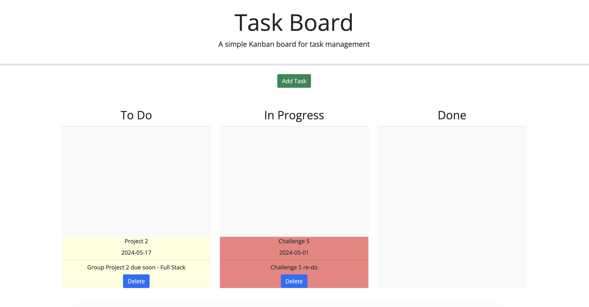
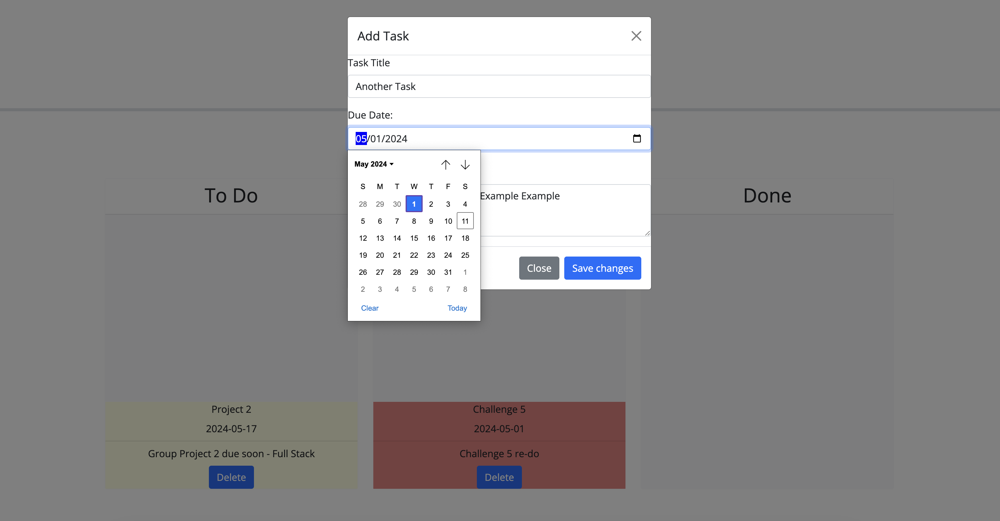

# TaskBoard
TaskBoard or Challenge 5 consists of implementing my new skills with third party APIs to create a Task Board.  It demonstrates the use of jQuery and JavaScript Bootstrap. This challenge also reinforces aspects of HTML and functions in JavaScript.

## Features
Notes:  There are notes throughout the code I used to help label and understand what was done.

Clean Code: Most of the HTML code was already provided.  I tried to continue using clean and clear HTML code when creating my Modal.  I also made sure my JavaScript code was done in a clear and organized way.

User Friendly: The code I created should make the user experience very friendly.  This includes filling out the Task form, moving the task to whichever column they think is necessary for said task, make deleting the tasks easy, and ensure all tasks are saved that the user wants saved.

Collaberation: I have given credit to those who assisted me with this project.  Their assistance ranges for guiding me in the right direction when doing document research for the correct code to helping me debug my code. 

## Resources and Technologies Used

Visual Studio Code
    This program was used for coding and the following links give more information on the program and its license. 
        https://code.visualstudio.com/
        https://code.visualstudio.com/license

Bootstrap
    This website was used for JavaScript plugins. The following links give more information on Bootstrap, the resources they provide, as well as its license.
        https://getbootstrap.com/
        https://github.com/twbs/bootstrap/blob/main/LICENSE

jQuery user interface
    This website was used for interface and effects for JavaScript.  The following links go to the jQuery main page and the page I used for this project.  I have also included links to their license. 
        https://jquery.com/
        https://jqueryui.com/
        https://jquery.com/license/

GitHub
    This website was used to upload all my code into a repository and help track progress of any changes made. The following link will also allow anyone to sign up if they choose to use it for their own personal work. The second link provided will provide their terms of service.
        https://github.com/
        https://docs.github.com/en/site-policy/github-terms/github-terms-of-service

Xpert Learning Assistant
    This is an AI that was specifically designed to assist students like myself in this Full Stack Web Development Bootcamp. It did assist me with detailed questions I had with my code. 

ChatGPT 3.5
    I used this AI to confirm the information I was given by the learning assistant. I also used it to ask questions if I was still not able to understand what SXpert Learning Assistant was telling me.
        https://chat.openai.com/
        https://openai.com/policies/terms-of-use

## Acknowledgements
    I would like to thank my classmates for assisting me with this challenge for our Full Stack Web Development course. It has been appreciated and meaningful that we have all been there to help each other.
    Max Bonetti
    Bryce McWhirter
    Beth-Ann
    Lee Norrell

## License
MIT

## Live Website & Screenshots
https://sashuttle.github.io/TaskBoard/

## Contact
GitHub: https://github.com/Sashuttle